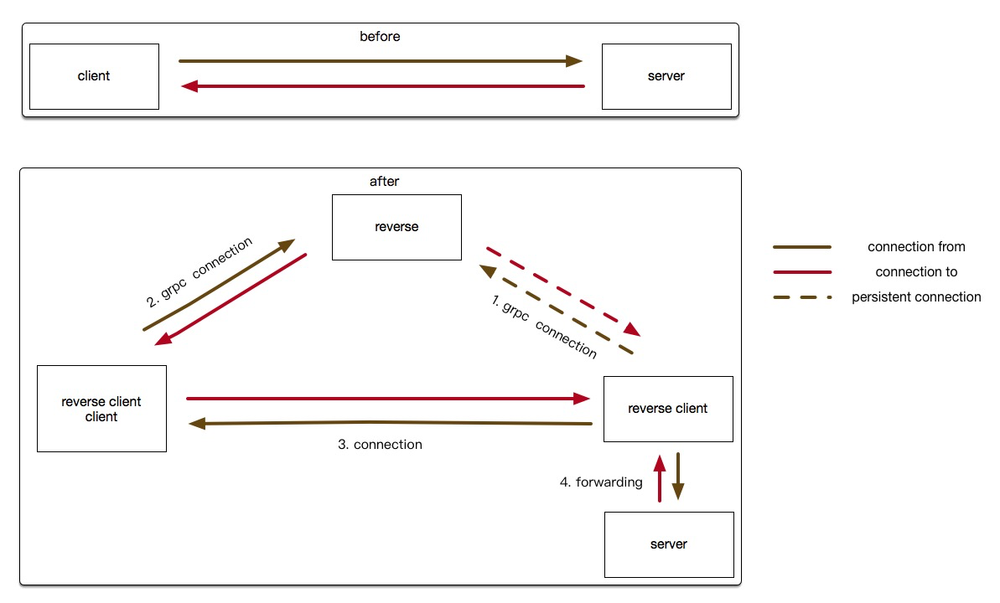

# reverse

reverse connection base on grpc.

## usage

client is for server side client.

service is for server side service.

rpc is reverse rpc server.

1. client should listen on one port, and send ClientConnect to reverse server.
2. reverse server use persistent connection to tell reverse client (server side) to connect to the client port.
3. reverse client(server side) should connect to client port and connect to server ,then act as a proxy pass the request.

Don't need to change server code.

## example

[example](./example/README.md)